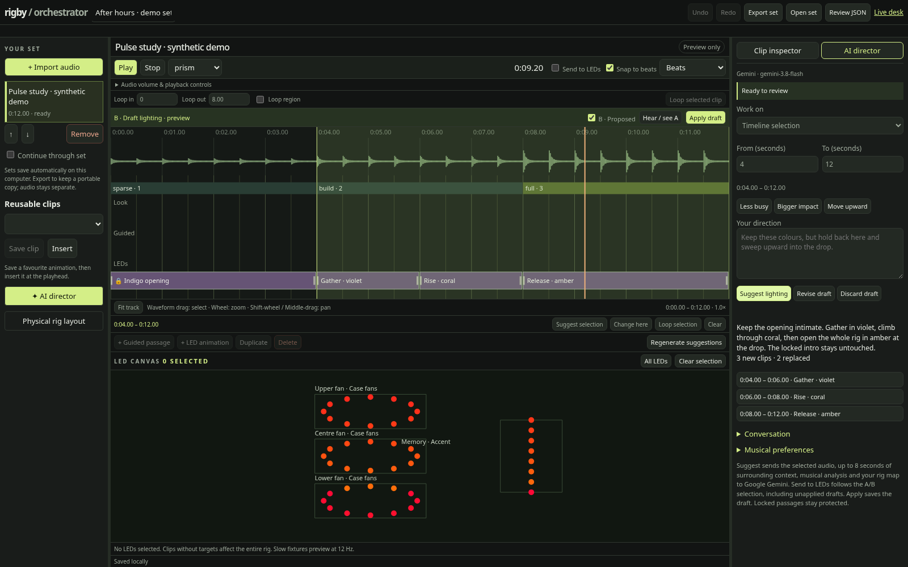
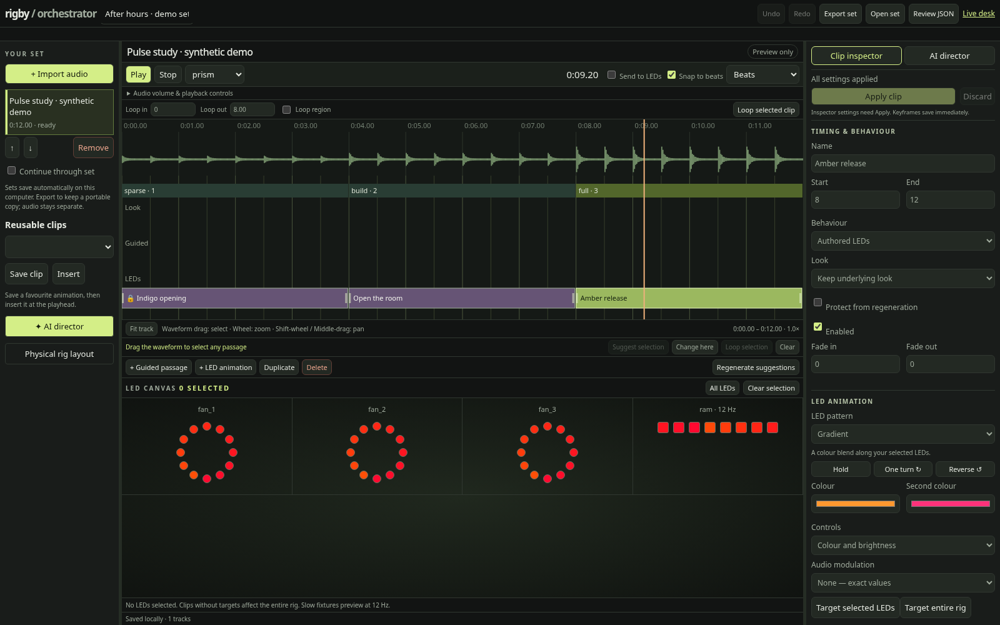
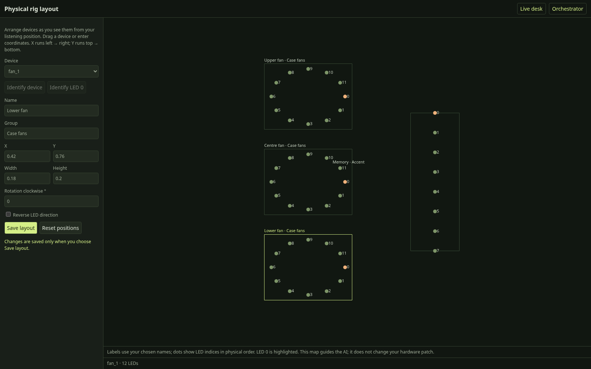

# rigby

**Light your music. Shape the show.**

Rigby is an audio-reactive lighting desk for OpenRGB, with a timeline editor,
individual LED animation, and an optional AI director that works from actual
song audio and the physical layout of your devices.

Let it follow whatever is playing, choreograph a favourite track, or ask the AI
to build a first draft and refine the moments that matter.

[Get started](#get-started) · [AI director](#direct-with-ai) · [Arrange your LEDs](#map-your-rig) · [Documentation](#documentation)



*The real editor with a synthetic demo track and a simulated AI proposal. Screenshots use virtual fixtures.*

## What you can do

- **Follow the music live.** Looks respond to frequency balance, attacks, rhythmic
  intensity, and changing energy, with space left for quiet passages and drops.
- **Build a lighting set.** Import tracks, arrange clips on a waveform timeline,
  loop passages, and play through an ordered set.
- **Animate individual LEDs.** Target fixtures or specific LEDs, keyframe colour
  and movement, and create sweeps, ripples, gradients, and paths across the rig.
- **Direct in plain language.** Generate or revise any passage with Gemini, compare
  saved and proposed lighting, and audition the draft on your LEDs before saving.
- **Keep the parts you like.** Lock passages, save reusable clips, undo edits, and
  export arrangements as JSON.

OpenRGB handles device communication. Rigby handles analysis, animation, and playback.

## Get started

Rigby's live audio capture targets **Linux with PipeWire/PulseAudio**. You'll need
**Python 3.13+** and **uv**. Install **FFmpeg** (including `ffprobe`) for audio
import and file playback, and make sure `parecord` and `pactl` are available for
live system-audio capture. Driving hardware also requires OpenRGB with its SDK
server enabled and your devices accessible.

```sh
git clone https://github.com/georgemunyoro/rigby.git
cd rigby
uv sync
```

### Try the editor without hardware

```sh
uv run rigby-editor
```

Open **http://127.0.0.1:8722/orchestrator**, import a local audio file, and explore
the timeline with virtual fixtures. No OpenRGB connection or AI key is required.

### Drive your LEDs

Start OpenRGB's SDK server, either from OpenRGB or in another terminal:

```sh
openrgb --server
```

Then start Rigby:

```sh
uv run rigby --look prism --control
```

Open **http://127.0.0.1:8721** for the live desk. Play music through your usual
output and adjust the look, colour, and brightness while it runs. The desk also
links to **Orchestrator** and **Rig layout**, using your actual devices.

For track orchestration without a live system-audio tap:

```sh
uv run rigby --no-audio --control
```

Open the orchestrator, import a track, enable **Send to LEDs**, and press **Play**.
Keep the browser open for arrangement playback. Ctrl-C stops Rigby and blacks
out the lights.

## Choose a live look

| Look | Character |
| --- | --- |
| `prism` | Spectrum response with restrained two-tone movement and larger colour changes on musical lifts. |
| `spectrum` | A frequency-driven wash with moving gaps and local percussion accents. |
| `duotone` | Two-colour rotating gestures, rhythmic accents, and wider coverage as energy grows. |
| `rain` | Gentle drops in soft passages; sharper splashes and denser activity in percussive passages. |
| `auto` | Blends duotone and rain behaviour according to rhythmic confidence and energy. The CLI default. |
| `chase` | An audio-independent chase for checking your rig. |

```sh
uv run rigby --look duotone --duo vapor --control
uv run rigby --look rain --master 0.6 --control
uv run rigby --look chase --no-audio
```

You can also analyse and play a file directly:

```sh
uv run rigby --source file:track.mp3 --look prism
```

## Choreograph a track



The orchestrator layers your edits over an automatic look. Use guided clips to
shape a passage, or authored clips to take control of its LEDs and animation.

1. **Import audio.** Wait for decoding, analysis, and lighting preparation.
2. **Find a passage.** Drag over the waveform to select it. Scroll to zoom around
   the pointer; Shift-scroll or middle-drag to pan. Drag sidebar dividers to resize.
3. **Shape the lighting.** Add a guided passage or LED animation, select its
   targets, and edit properties or keyframes. Use the inspector's **Apply clip** button
   for parameter changes; keyframe edits save directly.
4. **Loop and refine.** Audition the passage on screen or enable **Send to LEDs**
   in the live editor. Lock clips you want to protect from regeneration.
5. **Save your set.** Applied edits save locally. **Export set** creates portable
   JSON; audio files remain separate.

See the [orchestrator guide](docs/orchestrator.md) for animation patterns,
layer ownership, shortcuts, playback, and import/export details.

## Direct with AI

The AI director receives the selected audio, measured musical features, a diagram
of your rig, and individual LED positions. That gives it timing and spatial
context for directions such as:

> Keep the opening dark and spacious. Build upward through violet and coral,
> then open the whole rig in warm amber at the drop.

Set your Gemini key in the server environment before starting Rigby:

```sh
export GEMINI_API_KEY="your-api-key"
uv run rigby --no-audio --control
# Or use virtual fixtures: uv run rigby-editor
```

Open **AI director** beside the timeline. Work on a whole track, drag a passage
and choose **Suggest selection**, or revise an existing draft with more direction.

- **A/B** switches between saved lighting and the proposal at the same playhead.
- **Send to LEDs** follows that selection, including unapplied drafts.
- **Apply draft** saves the proposal. Auditioning alone does not save it.
- **Locked passages** stay protected when generating and refining proposals.

AI is optional and requires your own Gemini API access. Generation sends the
selected audio plus up to eight seconds of surrounding context on each side,
analysis, rig layout, and direction to Google Gemini. Provider usage charges
apply. The key stays on the server and is not included in exported sets.

See [AI setup and workflow](docs/orchestrator.md#ai-lighting-director) for model
configuration and details.

## Map your rig



Open **Rig layout** from the live desk or **Physical rig layout** from the
orchestrator. Drag devices into place, name and group them, and adjust size,
rotation, and LED direction. With hardware connected, identify a device or LED 0
to match the map to what you see. Save when you're done.

The layout editor works independently of audio and AI. Its map supplies spatial
context for AI direction and rig-wide animation. Configure the actual hardware
patch—zone lengths, fan chains, and wiring order—in the live desk's **Devices** tab.

## A few useful checks

| Symptom | Start here |
| --- | --- |
| No reaction to music | Run `uv run rigby --meter` and check that the default output monitor has a signal. |
| Everything is dim | Check input volume first, then master, gain, and curve. See [brightness tuning](docs/reference.md#too-dim). |
| Lights lead Bluetooth audio | Try `--offset-ms 200`, then adjust by eye. Wired output usually starts at `0`. |
| Fans repeat the same animation | A passive ARGB splitter mirrors the signal; independent control requires separately addressable segments. |
| Editor cannot drive hardware | Use Orchestrator from `rigby --control`; `rigby-editor` uses virtual fixtures. Enable **Send to LEDs**. |
| Another editor cannot open the store | Only one Rigby process can own a given arrangement directory at a time. |

## Local data and network access

Device calibration lives in `~/.config/rigby/config.json`. Arrangements, imported
audio, prepared analysis, and AI layout settings live under
`~/.local/share/rigby/orchestrator` by default. Back up that directory along with
any exported sets you want to keep.

**The HTTP controls have no authentication.** Both servers bind to localhost by
default. Anyone who can reach the port can control lighting, access imported
audio, and initiate AI requests using the server's key. Do not expose the server
to the public internet; binding to `0.0.0.0` makes it reachable on your network.

## Documentation

- [Orchestrator guide](docs/orchestrator.md) — editing, AI direction, physical layout, and playback.
- [Live lighting and technical reference](docs/reference.md) — calibration, audio analysis, effect design, and benchmarks.
- [Music validation](docs/music-validation.md) — evaluating timing, dynamics, and musical behaviour.

## Development

Rigby is Python with browser interfaces served by the application; there is no
separate frontend build.

```sh
uv run python -m unittest discover -s tests -v
uv run python check_ui.py

# Browser workflows (install Chromium once):
uv run --with playwright playwright install chromium
uv run --with playwright python tests/browser_orchestrator.py
uv run --with playwright python tests/browser_ai_director.py
```

The browser workflows use isolated stores and synthetic audio; AI tests simulate
the provider. `check_ui.py` requires Node.js to check the embedded JavaScript.

| Area | Code |
| --- | --- |
| Audio analysis and musical timing | [`analyze.py`](src/rigby/analyze.py), [`music.py`](src/rigby/music.py) |
| Live looks and effect primitives | [`show.py`](src/rigby/show.py), [`fx.py`](src/rigby/fx.py) |
| Device mapping and output | [`patch.py`](src/rigby/patch.py), [`sink.py`](src/rigby/sink.py) |
| Arrangement validation and rendering | [`arrangement.py`](src/rigby/arrangement.py), [`orchestrator.py`](src/rigby/orchestrator.py) |
| Gemini direction and proposal handling | [`ai_director.py`](src/rigby/ai_director.py) |
| Editor routes and interfaces | [`editor_server.py`](src/rigby/editor_server.py), [`editor_ui.py`](src/rigby/editor_ui.py), [`editor_ai_ui.py`](src/rigby/editor_ai_ui.py), [`rig_layout_ui.py`](src/rigby/rig_layout_ui.py) |
